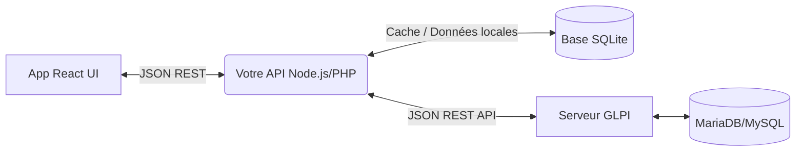

# 🏗️ Analyse Approfondie de GLPI : Base de données, Imports et Architecture API

Cette analyse détaille la structure interne de GLPI pour répondre à vos besoins spécifiques : la réinitialisation sélective des données, les mécanismes d'import, et l'intégration future avec une application React via l'API REST en utilisant SQLite.

---

## 1. Réinitialisation Sélective des Données (Reset)

L'architecture de la base de données de GLPI (MariaDB/MySQL) est très riche (souvent plus de 300 tables). Les tables sont généralement nommées avec le préfixe `glpi_`.
Pour réinitialiser une instance GLPI tout en gardant la configuration (utilisateurs, règles, entités), il faut faire la distinction entre les **tables de transactions/actifs** (à vider) et les **tables de configuration/référentiel** (à conserver).

### 🗑️ Données à supprimer (Tables à TRUNCATE)
Ces tables contiennent les données "vivantes" de l'entreprise (matériel et assistance).
- **Le Parc Informatique (Assets) :** `glpi_computers`, `glpi_monitors`, `glpi_printers`, `glpi_networkequipments`, `glpi_peripherals`, `glpi_phones`, `glpi_softwares`, `glpi_softwareversions`, `glpi_softwarelicenses`.
- **L'Assistance (ITIL) :** `glpi_tickets`, `glpi_tickettasks`, `glpi_ticketfollowups`, `glpi_ticketvalidations`, `glpi_problems`, `glpi_changes`.
- **Les Liaisons & Historiques :** `glpi_computers_items` (liaisons matérielles), `glpi_logs` (historique complet des actions), `glpi_events` (journal système), `glpi_documents_items` (pièces jointes liées).
- **Finances & Contrats :** `glpi_infocoms`, `glpi_contracts`, `glpi_contracts_items`.

### 🛡️ Données à conserver (Ne PAS toucher)
Ces tables contiennent l'ossature et la configuration du système.
- **Structure de l'entreprise :** `glpi_entities` (Entités), `glpi_locations` (Lieux).
- **Comptes et Droits :** `glpi_users` (Utilisateurs), `glpi_profiles` (Profils), `glpi_profiles_users` (Liaisons utilisateurs/profils).
- **Intitulés (Listes déroulantes) :** Toutes les tables finissant par `...types` ou `...models` (ex: `glpi_computertypes`, `glpi_computermodels`, `glpi_states`).
- **Configuration système :** `glpi_configs` (Configuration globale), `glpi_crontasks` (Tâches planifiées), `glpi_authldaps` (Annuaire Active Directory/LDAP), `glpi_rules` (Règles métier).

> [!WARNING]
> Avant de vider ces tables avec des requêtes SQL (`TRUNCATE TABLE glpi_computers;`), il est essentiel de désactiver temporairement les contraintes de clés étrangères (`SET FOREIGN_KEY_CHECKS = 0;`), puis de les réactiver à la fin.

---

## 2. Fonctionnalités d'Import de Fichiers

GLPI gère les imports de données de deux manières principales, selon que l'on parle de fichiers physiques (documents) ou d'imports massifs de données (fichiers CSV).

### A. L'import de données (Matériel, Utilisateurs, etc.)
En natif, GLPI est limité pour l'import CSV. L'outil standard utilisé par tous les professionnels est le plugin **Data Injection (Form Creator / DataInjection)**.
- **Principe :** Il permet d'importer des fichiers `.csv`.
- **Fonctionnement :** Vous créez un "Modèle" d'import dans lequel vous mappez les colonnes de votre fichier CSV avec les champs de la base de données GLPI (ex: `Colonne A = Nom de l'ordinateur`, `Colonne B = Numéro de série`).

### B. L'import par API (Pour votre future application React)
Si vous créez une application externe, vous n'utiliserez pas de CSV, mais l'API REST native de GLPI.
- GLPI intègre une API REST accessible via `http://localhost/glpi/apirest.php`.
- Vous pouvez envoyer des payloads JSON en `POST` vers le endpoint d'un objet (`/apirest.php/Computer/`) pour le créer automatiquement.

---

## 3. Architecture : GLPI API REST + React + SQLite

Votre objectif de créer une application React avec un stockage SQLite tout en communiquant avec GLPI en API REST est une excellente approche d'architecture moderne (Headless). 

Cependant, il faut comprendre un point crucial : **GLPI lui-même ne peut pas fonctionner sur SQLite**. Il nécessite obligatoirement MariaDB ou MySQL. SQLite interviendra donc du côté de votre application / middleware.

### Comment architecturer cette solution ?

1. **Le Backend GLPI (MySQL/MariaDB)**
   - Il reste le "Master Data Management". Il héberge la base MariaDB et expose son API REST (`apirest.php`).
   - Il gère la logique métier complexe (calcul des amortissements, cycles de vie des tickets, gestion des droits).

2. **Votre API Intermédiaire / Backend Node.js (avec SQLite)**
   - Pour ne pas surcharger l'API de GLPI (et pour des raisons de performance ou pour stocker des données spécifiques à votre app React qui ne rentrent pas dans GLPI), vous pouvez créer un backend léger (ex: en Node.js/Express ou Python/FastAPI) couplé à une base **SQLite**.
   - **Rôle de SQLite :** Mettre en cache les données récupérées depuis GLPI pour un affichage ultra-rapide, stocker les préférences des utilisateurs de votre app React, ou gérer une file d'attente hors-ligne.
   - Ce backend communique avec GLPI via des requêtes HTTP (avec les headers `Session-Token` et `App-Token`).

3. **Le Frontend React**
   - Votre application React consomme les données JSON.
   - Si un utilisateur modifie un "Ordinateur" dans React, l'application React envoie une requête JSON à votre backend Node.js (qui met à jour sa base SQLite), puis le backend Node.js fait une requête `PUT /apirest.php/Computer/{id}` à GLPI pour synchroniser la donnée officielle.

### Flux de communication (Exemple)

> [!TIP]
> **Authentification API GLPI :** Pour utiliser l'API REST de GLPI avec votre app, vous devrez d'abord appeler l'endpoint `/initSession` avec un `App-Token` (défini dans la config GLPI) et générer un `Session-Token` qui devra être inclus dans l'en-tête de tous vos appels JSON ultérieurs.
